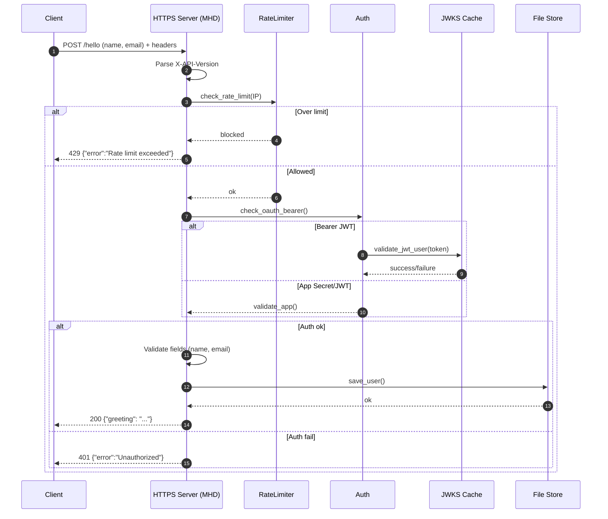
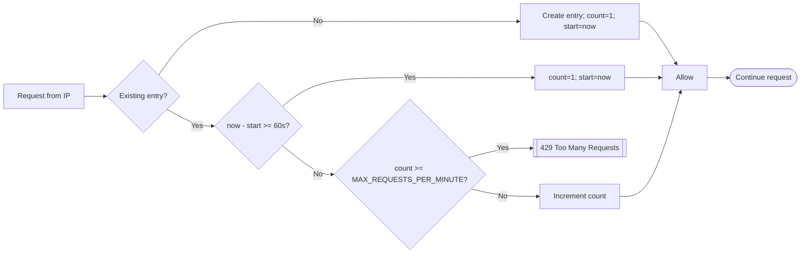

# Hello World Cross-Platform JWT REST API (C)

This project is a secure, production-ready, cross-platform REST API server written in C, designed to demonstrate best practices for authentication, config management, and portability. It emphasizes strong security defaults (HTTPS, JWT verification via JWKS, replay protection, and rate limiting), dynamic configuration, and platform portability (Linux, macOS, Windows).

## Features

- Cross-Platform: Runs on Linux, macOS, and Windows with minimal changes.
- JWT & JWKS Support: Validates JSON Web Tokens using live keys from multiple providers (Google, Microsoft, Auth0, Okta, Apple).
- Dynamic Config: Reload `config.json` on the fly (SIGHUP on POSIX, Ctrl+Break on Windows) without server restart.
- Strong Security: Rate limiting, nonce replay protection, structured logging, and security headers.
- API Versioning: Accepts API version via HTTP headers for forward compatibility.
- Thread-Safe: Handles concurrency, provider map, and cleanup.
- No Recompilation for Most Changes: Change providers/secrets/limits via config, not code.

## Visual Diagrams (Mermaid)

> Note: GitHub renders Mermaid diagrams in Markdown automatically. If viewing locally, use an editor with Mermaid preview support or the Mermaid CLI.

### High-Level Architecture

```mermaid
graph LR
  C[Client] -->|HTTPS| CW[CivetWeb Server]
  CW --> RL[Per-IP Rate Limiter]
  RL -->|allowed| AUTH[Auth Gateway]
  RL -->|blocked| ERR429[[429 JSON Error]]

  AUTH -->|Bearer JWT| JWKS[Provider Map + JWKS Cache]
  AUTH -->|App Secret / App JWT| APP[App Validator]

  AUTH -->|ok| API[/POST /hello/]
  AUTH -->|fail| ERR401[[401 JSON Error]]

  API --> VAL[Input Validation]
  VAL --> IO[save_user(users.bin)]
  IO --> RESP[[JSON Response]]
```

### Request Lifecycle



### JWKS Refresh and Verification

```mermaid
flowchart TD
  Start([Start JWT Verify]) --> TTL{Cache TTL expired?}
  TTL -- No --> UseCache[Use cached PEM] --> Verify[Verify signature]
  TTL -- Yes --> Fetch[fetch_jwks()] --> Parse[Parse keys]
  Parse --> HasKID{KID match?}
  HasKID -- Yes --> Conv[convert_jwk_to_pem()]
  HasKID -- No --> FirstRSA[Pick first RSA key] --> Conv
  Conv --> Cache[Cache PEM, update KID, last_refresh] --> Verify
  Verify --> Ok{Signature OK?}
  Ok -- Yes --> Proceed([Accept + check claims])
  Ok -- No --> Fail[[401/400 error]]
```

### Rate Limiting (Per-IP, 60s Window)



### Nonce Replay Protection

```mermaid
flowchart LR
  N[X-Nonce header] --> Len{0 < len(nonce) < 64?}
  Len -- No --> Reject[[401 Invalid/Empty nonce]]
  Len -- Yes --> Exists{Already used?}
  Exists -- Yes --> Reject[[401 Reused nonce]]
  Exists -- No --> Add[Add to table] --> OK([Continue])
```

### Data Persistence Path

```mermaid
flowchart LR
  Fields[name,email] --> Validate[Validate format + length]
  Validate -- fail --> E400[[400 Invalid name/email]]
  Validate -- ok --> Open[open_user_file(O_NOFOLLOW)]
  Open --> Lock[lock_file]
  Lock --> Write[write User struct]
  Write --> Unlock[unlock_file]
  Unlock --> Close[close fd]
  Close --> Done[[OK]]
```

### Dynamic Config Reload

```mermaid
flowchart LR
  Sig[SIGHUP / Ctrl+Break] --> Flag[Set reload flag]
  Flag --> Loop[Main loop detects flag]
  Loop --> Reload[reload_config(config.json)]
  Reload --> Parse[load_config + apply globals]
  Parse --> Providers[Rebuild provider map]
  Providers --> Refresh[Initial refresh_provider()]
  Refresh --> Resume([Resume handling requests])
```

## Build

CivetWeb is now used as the HTTP server library instead of libmicrohttpd. Build in two steps:

### Step 1: Compile CivetWeb
- Linux/macOS:  
  ```bash
  gcc -c civetweb.c -o civetweb.o -DUSE_SSL -DNO_SSL_DL -DOPENSSL_API_3_0 -I. -fPIC
  ```
- Windows (MinGW):  
  ```bash
  gcc -c civetweb.c -o civetweb.o -DUSE_SSL -DNO_SSL_DL -DOPENSSL_API_3_0 -I.
  ```

### Step 2: Compile and Link Application
- Linux:  
  ```bash
  gcc -c hello.c -o hello.o -I. -Wno-format-truncation -Wno-deprecated-declarations
  gcc hello.o civetweb.o -o server -lcurl -lssl -lcrypto -ljansson -ljwt -lpthread -ldl
  ```
- macOS:  
  ```bash
  clang -c hello.c -o hello.o -I. -Wno-format-truncation -Wno-deprecated-declarations
  clang hello.o civetweb.o -o server -lcurl -lssl -lcrypto -ljansson -ljwt -lpthread
  ```
- Windows (MinGW):  
  ```bash
  gcc -c hello.c -o hello.o -I.
  gcc hello.o civetweb.o -o server.exe -lcurl -lssl -lcrypto -ljansson -ljwt -lpthread -lws2_32
  ```

Ensure dependencies: `jansson`, `libcurl`, `openssl`, `libjwt`, `uthash` (included), `civetweb` (included).

## Usage

1. Edit `config.json` to define your server, keys, and JWT providers.
2. Run: `./server`  
   The server will listen on the port configured in `config.json` (default 8443, HTTPS).
3. API usage example:

   ```bash
   curl -k -X POST \
        -H "Authorization: Bearer <JWT>" \
        -H "X-Nonce: <unique-nonce>" \
        -H "X-API-Version: 1.1" \
        -d "name=Terry&email=terry@example.com" \
        https://localhost:8443/hello
   ```

4. Reload the config at runtime:
   - Linux/macOS: `kill -HUP <pid>`
   - Windows: Press `Ctrl+Break` in the server console

## API Summary

- Endpoint: `POST /hello`
- Headers:
  - User JWT: `Authorization: Bearer <token>`, `X-Nonce: <unique>`
  - App auth (fallback): `X-App-Secret: <secret>` or `X-App-Token: <app-jwt>`
  - Versioning: `X-API-Version: 1.0` or `1.1` (default `1.0`)
- Body (form-encoded): `name=...&email=...`
- Responses:
  - 200: `{ "greeting": "...", "version": "..." }`
  - 400/401/404/413/429/500 with `{ "error": "<reason>" }`

## Security Notes

- Always use strong secrets and rotate keys.
- Configure HTTPS certificates and set minimal file permissions for keys and configs.
- Consider redacting PII in logs for production environments.

## Maintainer

[terry-teppo](https://github.com/terry-teppo) • terry-teppo@users.noreply.github.com

## Example `config.json`

See the included `config.json` for an example with multiple JWT providers.

## License

[MIT](LICENSE)
